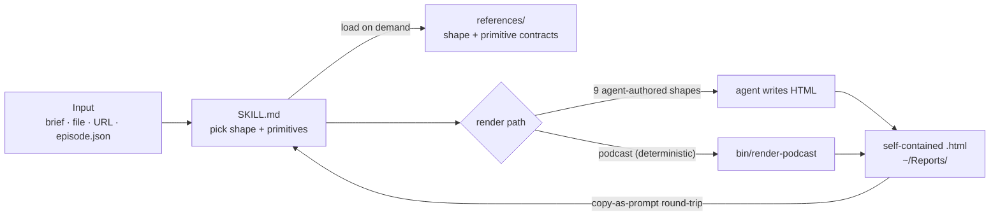

# render-as-html

> A Claude Code / Codex skill that treats the HTML file as the artifact, not an export of one. Filters, sortable tables, SVG charts, drag-and-drop boards, copy-as-prompt buttons. You edit the page in the browser, paste an instruction back, the model updates the file.
>
> Inspired by [@trq212's "Unreasonable Effectiveness of HTML"](https://x.com/trq212/status/2052809885763747935).

**Version 2.6.3** · live design system at **https://twidtwid.github.io/render-as-html/** · canonical primitives at [`examples/primitives.html`](https://twidtwid.github.io/render-as-html/examples/primitives.html).

## Install

**Claude Code**

```bash
git clone https://github.com/twidtwid/render-as-html ~/.claude/skills/render-as-html
```

**Codex**

```bash
mkdir -p "${CODEX_HOME:-$HOME/.codex}/skills"
git clone https://github.com/twidtwid/render-as-html "${CODEX_HOME:-$HOME/.codex}/skills/render-as-html"
```

Restart the agent. Then say `make an HTML artifact for this`, `turn this into an interactive HTML file`, `update this HTML artifact`, or `/render-as-html`.

Output lands at `~/Reports/<YYYY-MM-DD>-<slug>.html` and opens in your browser. That file is the thing — edit it directly, or feed it back to the model with a follow-up.

To update later: `git -C <install-path> pull`.

## Why this exists

This repo is an implementation of [@trq212's HTML-artifact philosophy](https://x.com/trq212/status/2052809885763747935), not an attempt to rebrand it. The claim I'm borrowing: HTML can be the file you keep, not an export, preview, or PDF-like rendering of another canonical document. The browser artifact becomes the working surface and the source of truth.

Thariq's key move is that HTML lets the artifact control layout, styling, state, interaction, and round-trip edits directly. Use the browser for the parts where it's clearly better: live filters, sortable headers, SVG charts, cross-highlighting, drag-and-drop, sliders, checkboxes, copy-as-prompt buttons. You mutate state in the browser, copy a precise instruction, paste it into the model, update the `.html` file, keep going.

My contribution is the opinionated design system and page-shape contracts around that idea. Not a prettier document — a local, inspectable, editable HTML file that's still useful the second time you open it.

## Scope

`render-as-html` is a design system and skill for writing and updating standalone HTML artifacts. It does not fetch URLs, parse arbitrary exports, or crawl repos. The one packaged renderer — `bin/render-podcast` — converts podcastextract's `episode.package.json` into the podcast shape's two-file output, and exists only because that workflow is fully deterministic. Every other shape is produced by the skill agent, not a CLI.

## Architecture

Input → shape routing in `SKILL.md` → one of two render paths → a self-contained HTML file that round-trips back through copy-as-prompt:



The two non-obvious moves: the per-shape and per-primitive contracts load **on demand** from `references/` (the always-loaded `SKILL.md` stays a routing index), and the **podcast path is the one deterministic CLI** — every other shape is agent-authored against the design-system contracts.

## What's in here

- `SKILL.md` — read this first. Page shapes, design system, canonical primitives, copy-as-prompt, the "would this die outside HTML?" bar. Each shape and primitive carries a compact inline stub; the full contract loads on demand from `references/`.
- `DESIGN.md` — the canonical design tokens in the [design.md](https://github.com/google-labs-code/design.md) format. The single source of truth for the palette/type that `SKILL.md` and `index.html` derive from. Internal build input, not a user-tunable knob.
- `index.html` — the design system as a single file (the live link above).
- `examples/` — thirteen self-contained artifacts: one per page shape (now including `podcast-transcript.html` for the transcript view), plus a canonical-primitives reference. Browse the [example gallery](https://twidtwid.github.io/render-as-html/examples/).
- `bin/render-podcast` — Python CLI that consumes podcastify's `episode.package.json` and writes a `podcast-at-a-glance.html` + `annotated-transcript.html` pair matching the canonical examples. Usage: `bin/render-podcast <package.json> [-o OUT_DIR]`.
- `bin/og-card.mjs` — renders a 1200×630 social-card PNG from an artifact's own title/description/design tokens via headless Chrome, and with `--inject` writes `og:image`/`twitter:image` into the artifact `<head>` (`node bin/og-card.mjs <artifact.html> --inject`). Required by the publish flow in `SKILL.md` step 8.
- `tests/` — pytest suite (`uv run --with pytest pytest tests/ -v`) plus the fixture both canonical podcast examples render from.
- `scripts/perf_harness.py` — optimization harness for skill-token load, renderer speed, primitive coverage, and HTML source-document invariants (`uv run python scripts/perf_harness.py --check`).
- `scripts/lint-artifact.mjs` — runs the mechanical subset of the SKILL pre-save checklist against a *generated* artifact at any path (`node scripts/lint-artifact.mjs <file.html>`). Turns "enforced by me" into "enforced by a tool".
- `scripts/check-tokens.mjs` — asserts the palette in `SKILL.md` and `index.html` has not drifted from `DESIGN.md` (`node scripts/check-tokens.mjs`).
- `scripts/review-contracts.mjs` — accessibility / contract lint over the repo's own example HTML.
- `LICENSE` — MIT.

## Page shapes

Pick the shape from content signals. Ten shapes, each with a contract — layout, required primitives, density, what to avoid:

| Shape | For | Distinct because |
|---|---|---|
| `dashboard` | Network scans, ops data, device explorers | Multi-column, filter bar, dense tables, charts |
| `document` | Plans, specs, briefings, essays | Single column, sticky TOC, per-section copy |
| `timeline` | Diaries, logs, retros, project histories | Vertical spine + date markers + event cards |
| `runbook` | DR, deploy guides, machine rebuilds | Sticky progress bar, per-step checkboxes, code-block copy buttons |
| `comparison` | "X vs Y vs Z" decision matrices | Items as **columns**, criteria as **rows**, weight sliders |
| <code>network&#8209;map</code> | People graphs, brain backlinks, dependencies | Big SVG canvas, click-to-focus, edge highlights |
| <code>triage&#8209;board</code> | GTD reorg, inbox triage | Drag cards between Now/Next/Later/Cut columns |
| `developer` | PR writeups, code review | Annotated diffs, severity findings, file nav |
| `editorial` | Deep essays, research synthesis, analytical memos | Sustained argument front-to-back, italic thesis, entity inspector rail |
| `podcast` | Podcast episodes from the podcastextract pipeline | Briefing + transcript pair, episode hero + thesis + takeaways + claims + term inspector, hide-sidebar focus mode |

## Canonical primitives

The page shapes are built out of ten reusable chart and table primitives. They share one palette, one type system, and one set of interaction rules, so a dashboard and a developer artifact feel like the same system.

| Primitive | Pick when |
|---|---|
| `donut` | Up to 5 slices of one total, share matters more than order |
| `ranked-bar` | "What's biggest" beats "what share" — bars sorted descending, labels in their own column |
| `sparkline-cluster` | Direction across many series in a header strip |
| `stacked-bar` | Composition over time, ≤4 segments |
| `topology` | Structure or routing matters more than count |
| `scatter` | Two well-spread dimensions, ≥10 points — the trade-off is the signal, not a ranking |
| `dense-table` | The reader needs to scan and compare specific rows |
| `comparison-matrix` | Trade-off across >2 options against shared criteria, items as columns |
| `annotated-diff` | A change that needs commentary, not just inspection |
| `log-stream` | Ongoing events matter more than aggregates |

Each one has a live reference with code at [`examples/primitives.html`](https://twidtwid.github.io/render-as-html/examples/primitives.html). The contracts (when to pick, what to avoid, required interactions) live in `SKILL.md` and in the [design system page](https://twidtwid.github.io/render-as-html/#charts).

Five rules cut across all of them: one palette, subgrid for cross-row column alignment, every filter has a visible clear, color is never the only signal, counts reflect underlying data — not the filtered view.

## Optimization guard

Run `make check` before changing the skill contract, examples, primitives, or `bin/render-podcast` — it runs the pytest suite, the perf harness, and the three Node linters; CI runs the same command on every push. The harness times the podcast renderer on the small fixture, a scaled fixture, and a complex synthetic Lenny's Podcast fixture based on public episode metadata from ["How to build a company that withstands any era"](https://www.lennysnewsletter.com/p/how-to-build-a-company-that-withstands). It also audits primitive registration and the "HTML is the source document" contract.

Two companion linters cover the surfaces the harness can't: `node scripts/check-tokens.mjs` guards the palette against drift between `DESIGN.md`, `SKILL.md`, and `index.html`; and `node scripts/lint-artifact.mjs <file.html>` runs the mechanical pre-save checks against a freshly generated artifact at any path — the agent should run it on its own output before reporting done.

## The bar

Ask what would disappear if this were flattened into a static text document. If only the SVG diagram disappears, it's styled prose, not a real HTML artifact. Try again. Aim for at least three HTML-native features: live filter, click-to-cross-highlight, inline charts, toggles, copy-as-prompt, drag-and-drop — pick your three.

## Sharing the output

The skill emits a vanilla `.html` file. Serve it however you want — locally, Tailscale Serve / Funnel, GitHub Pages, S3, `uv run python -m http.server`, whatever. By default, generated artifacts should be self-contained and make no external network requests.

Treat generated HTML as sensitive. It can embed private report text, file paths, internal hostnames, local IPs, account names, or other details that got pulled in while building the artifact. `SKILL.md` sketches a private-by-default, publish-on-explicit-trigger pattern if you want one.

## Credits

- HTML-artifact framing and copy-as-prompt pattern: [@trq212](https://x.com/trq212), ["The Unreasonable Effectiveness of HTML"](https://x.com/trq212/status/2052809885763747935)
- Content-matched-shapes idea: [clockless-org/html-anything](https://github.com/clockless-org/html-anything)

## License

MIT
